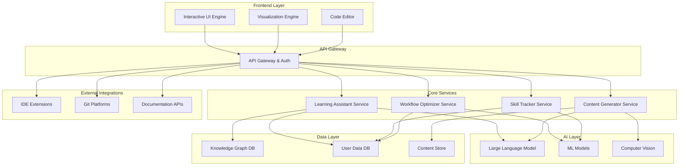

# Design Document: AI Learning Assistant

## Overview

The AI Learning Assistant is a sophisticated platform that combines artificial intelligence, modern web technologies, and educational psychology principles to create personalized learning experiences and enhance developer productivity. The system employs a microservices architecture with AI-powered components for content generation, learning path optimization, and workflow analysis.

The platform integrates multiple AI models including large language models for content generation, computer vision for diagram analysis, and machine learning algorithms for personalization. The frontend provides an interactive, visually appealing interface built with modern web technologies, while the backend manages AI orchestration, user data, and integrations with development tools.

## Architecture

### High-Level Architecture



### Service Architecture

The system follows a microservices pattern with the following key services:

1. **Learning Assistant Service**: Orchestrates personalized learning experiences
2. **Content Generator Service**: Creates and adapts educational content using AI
3. **Workflow Optimizer Service**: Analyzes and improves user productivity patterns
4. **Skill Tracker Service**: Monitors progress and manages competency assessments
5. **Gamification Service**: Manages gamified learning experiences and rewards
6. **Social Learning Service**: Facilitates community features and collaborative learning
7. **Integration Hub Service**: Manages external tool connections and data synchronization

## Components and Interfaces

### Learning Assistant Service

**Purpose**: Central orchestration service that manages personalized learning experiences and coordinates between other services.

**Key Interfaces**:
```typescript
interface LearningAssistant {
  createLearningSession(userId: string, topic: string): Promise<LearningSession>
  adaptToUserFeedback(sessionId: string, feedback: UserFeedback): Promise<void>
  generateLearningPath(userId: string, goals: LearningGoal[]): Promise<LearningPath>
  assessKnowledgeLevel(userId: string, topic: string): Promise<KnowledgeAssessment>
}

interface LearningSession {
  id: string
  userId: string
  topic: string
  currentStep: LearningStep
  progress: number
  adaptations: Adaptation[]
}
```

**Core Responsibilities**:
- Coordinate between content generation and skill tracking
- Maintain learning session state and progress
- Apply personalization algorithms based on user data
- Handle real-time adaptation to user performance

### Content Generator Service

**Purpose**: AI-powered service that creates, adapts, and formats educational content based on user needs and learning context.

**Key Interfaces**:
```typescript
interface ContentGenerator {
  generateExplanation(topic: string, context: LearningContext): Promise<Explanation>
  createVisualDiagram(concept: string, style: VisualizationStyle): Promise<Diagram>
  generateCodeExamples(topic: string, language: string): Promise<CodeExample[]>
  adaptContentComplexity(content: Content, targetLevel: ComplexityLevel): Promise<Content>
}

interface Explanation {
  id: string
  content: string
  format: ContentFormat
  visualAids: VisualAid[]
  interactiveElements: InteractiveElement[]
  sources: Reference[]
}
```

**AI Integration**:
- Utilizes large language models for text generation and explanation
- Employs computer vision for diagram analysis and generation
- Implements natural language processing for context understanding
- Uses machine learning for content quality assessment

### Workflow Optimizer Service

**Purpose**: Analyzes user work patterns and provides intelligent recommendations for productivity improvements.

**Key Interfaces**:
```typescript
interface WorkflowOptimizer {
  analyzeWorkPattern(userId: string, timeframe: TimeRange): Promise<WorkflowAnalysis>
  generateOptimizations(analysis: WorkflowAnalysis): Promise<Optimization[]>
  trackProductivityMetrics(userId: string): Promise<ProductivityMetrics>
  implementWorkflowChange(userId: string, optimization: Optimization): Promise<void>
}

interface WorkflowAnalysis {
  patterns: WorkPattern[]
  bottlenecks: Bottleneck[]
  efficiencyScore: number
  recommendations: Recommendation[]
}
```

### Gamification Service

**Purpose**: Manages gamified learning experiences including points, achievements, challenges, and social features to make learning engaging and motivating.

**Key Interfaces**:
```typescript
interface GamificationService {
  awardPoints(userId: string, activity: LearningActivity, points: number): Promise<void>
  unlockAchievement(userId: string, achievementId: string): Promise<Achievement>
  createChallenge(type: ChallengeType, difficulty: number, topic: string): Promise<Challenge>
  updateLeaderboard(userId: string, category: string, score: number): Promise<LeaderboardEntry>
  trackStreak(userId: string, activityType: string): Promise<StreakInfo>
}

interface Achievement {
  id: string
  title: string
  description: string
  iconUrl: string
  rarity: AchievementRarity
  unlockedAt: Date
  celebrationAnimation: AnimationType
}

interface Challenge {
  id: string
  type: ChallengeType
  title: string
  description: string
  difficulty: number
  timeLimit?: number
  rewards: Reward[]
  completionCriteria: CompletionCriteria
}
```

**Gamification Features**:
- **Points and Scoring**: Dynamic point system based on learning activities and achievements
- **Badge System**: Unlockable badges for various accomplishments and milestones
- **Leaderboards**: Social competition features with team and individual rankings
- **Streaks and Habits**: Tracking and rewarding consistent learning behavior
- **Challenges**: Interactive coding puzzles, quizzes, and time-based competitions
- **Customization**: Unlockable avatars, themes, and visual rewards

### Skill Tracker Service

**Purpose**: Monitors learning progress, maintains competency models, and provides assessment capabilities.

**Key Interfaces**:
```typescript
interface SkillTracker {
  updateSkillProgress(userId: string, skill: string, evidence: LearningEvidence): Promise<void>
  getSkillAssessment(userId: string): Promise<SkillAssessment>
  generateCompetencyMap(userId: string): Promise<CompetencyMap>
  recommendSkillDevelopment(userId: string): Promise<SkillRecommendation[]>
}

interface SkillAssessment {
  skills: SkillLevel[]
  overallCompetency: number
  strengthAreas: string[]
  improvementAreas: string[]
  nextMilestones: Milestone[]
}
```

### Social Learning Service

**Purpose**: Facilitates community features, peer learning, and social interactions to enhance engagement and collaborative learning.

**Key Interfaces**:
```typescript
interface SocialLearningService {
  createLearningGroup(creatorId: string, groupInfo: GroupInfo): Promise<LearningGroup>
  joinStudyCircle(userId: string, circleId: string): Promise<void>
  shareAchievement(userId: string, achievementId: string, platforms: SocialPlatform[]): Promise<void>
  facilitatePeerMentoring(mentorId: string, menteeId: string): Promise<MentoringSession>
  createDiscussionForum(topicId: string, forumInfo: ForumInfo): Promise<Forum>
}

interface LearningGroup {
  id: string
  name: string
  members: GroupMember[]
  sharedGoals: LearningGoal[]
  progressTracking: GroupProgress
  activities: GroupActivity[]
}
```

**Social Features**:
- **Learning Groups**: Create and manage study groups with shared goals and progress tracking
- **Peer Mentoring**: Structured mentoring programs with matching algorithms
- **Discussion Forums**: Topic-based forums for questions, discussions, and knowledge sharing
- **Achievement Sharing**: Social sharing of accomplishments and milestones
- **Community Contributions**: Recognition system for helping other learners

### UI Engine

**Purpose**: Provides interactive, visually appealing user interface with support for multiple learning modalities and gamified experiences.

**Key Features**:
- **Interactive Code Editor**: Real-time syntax highlighting, error detection, and execution
- **Dynamic Visualizations**: Animated diagrams, concept maps, and interactive charts
- **Gamification Engine**: Points, badges, achievements, leaderboards, and progress celebrations
- **Visual Rewards System**: Customizable avatars, themes, unlockable content, and achievement displays
- **Animation System**: Micro-interactions, particle effects, celebration animations, and smooth transitions
- **Adaptive Layout**: Responsive design that adapts to user preferences and device capabilities
- **Accessibility Support**: Screen reader compatibility, keyboard navigation, and visual accommodations

**Technology Stack**:
- React with TypeScript for component architecture
- Three.js for 3D visualizations, particle effects, and animations
- Monaco Editor for code editing capabilities
- D3.js for data visualizations and interactive charts
- Framer Motion for smooth animations and micro-interactions
- Canvas API for custom animations and visual effects
- Web Audio API for sound effects and audio feedback

## Data Models

### User Profile Model

```typescript
interface UserProfile {
  id: string
  preferences: LearningPreferences
  skillLevels: Map<string, SkillLevel>
  learningHistory: LearningActivity[]
  workflowPatterns: WorkflowPattern[]
  integrations: ExternalIntegration[]
}

interface LearningPreferences {
  modalityPreference: LearningModality[]
  complexityPreference: ComplexityLevel
  pacePreference: LearningPace
  visualStyle: VisualizationPreference
  interactionStyle: InteractionPreference
}
```

### Knowledge Graph Model

```typescript
interface KnowledgeNode {
  id: string
  concept: string
  description: string
  difficulty: number
  prerequisites: string[]
  relatedConcepts: ConceptRelation[]
  content: ContentReference[]
}

interface ConceptRelation {
  targetConceptId: string
  relationType: RelationType
  strength: number
}
```

### Content Model

```typescript
interface Content {
  id: string
  type: ContentType
  topic: string
  complexity: ComplexityLevel
  format: ContentFormat
  data: ContentData
  metadata: ContentMetadata
  assessments: Assessment[]
}

interface ContentData {
  text?: string
  code?: CodeContent
  visual?: VisualContent
  interactive?: InteractiveContent
  audio?: AudioContent
}
```

### Learning Session Model

```typescript
interface LearningSession {
  id: string
  userId: string
  startTime: Date
  currentTopic: string
  progress: SessionProgress
  interactions: UserInteraction[]
  adaptations: SessionAdaptation[]
  outcomes: LearningOutcome[]
}

interface SessionProgress {
  completedSteps: number
  totalSteps: number
  timeSpent: number
  engagementScore: number
  comprehensionScore: number
}
```

### Gamification Model

```typescript
interface UserGamificationProfile {
  userId: string
  totalPoints: number
  level: number
  achievements: Achievement[]
  badges: Badge[]
  streaks: StreakRecord[]
  leaderboardRankings: LeaderboardEntry[]
  customizations: UserCustomization
}

interface Achievement {
  id: string
  title: string
  description: string
  category: AchievementCategory
  rarity: AchievementRarity
  pointsAwarded: number
  unlockedAt: Date
  celebrationStyle: CelebrationStyle
}

interface Challenge {
  id: string
  type: ChallengeType
  title: string
  description: string
  difficulty: DifficultyLevel
  timeLimit?: number
  participants: string[]
  rewards: Reward[]
  status: ChallengeStatus
}
```

### Social Learning Model

```typescript
interface LearningCommunity {
  groups: LearningGroup[]
  forums: DiscussionForum[]
  mentorshipPrograms: MentorshipProgram[]
  sharedAchievements: SharedAchievement[]
}

interface LearningGroup {
  id: string
  name: string
  description: string
  members: GroupMember[]
  sharedGoals: LearningGoal[]
  activities: GroupActivity[]
  progressTracking: GroupProgress
  createdAt: Date
}

interface DiscussionForum {
  id: string
  topicId: string
  title: string
  posts: ForumPost[]
  moderators: string[]
  tags: string[]
  activityLevel: ActivityLevel
}
```

## Error Handling

### Error Categories

1. **AI Service Errors**: Handle LLM timeouts, rate limits, and quality issues
2. **Integration Errors**: Manage external API failures and authentication issues
3. **User Input Errors**: Validate and sanitize user-provided content and preferences
4. **Data Consistency Errors**: Ensure knowledge graph and user data integrity
5. **Performance Errors**: Handle resource constraints and scaling issues

### Error Recovery Strategies

- **Graceful Degradation**: Provide alternative content when AI services are unavailable
- **Retry Logic**: Implement exponential backoff for transient failures
- **Fallback Content**: Maintain cached content for critical learning paths
- **User Notification**: Provide clear, actionable error messages to users
- **Monitoring and Alerting**: Track error rates and performance metrics

### Data Validation

```typescript
interface ValidationRules {
  validateUserInput(input: UserInput): ValidationResult
  validateContentQuality(content: Content): QualityScore
  validateLearningPath(path: LearningPath): PathValidation
  validateIntegrationData(data: IntegrationData): IntegrationValidation
}
```

## Testing Strategy

### Dual Testing Approach

The system requires both unit testing and property-based testing to ensure comprehensive coverage:

**Unit Testing Focus**:
- Specific AI model responses and content generation scenarios
- Integration points with external development tools
- User interface interactions and accessibility features
- Error handling and edge cases in learning algorithms
- Authentication and authorization workflows

**Property-Based Testing Focus**:
- Universal properties that must hold across all learning content
- Consistency properties for knowledge graph relationships
- Invariants in skill progression and assessment algorithms
- Round-trip properties for content serialization and API interactions
- Performance characteristics under varying load conditions

### Property-Based Testing Configuration

- **Testing Library**: Use Hypothesis for Python services, fast-check for TypeScript components
- **Test Iterations**: Minimum 100 iterations per property test to ensure thorough coverage
- **Test Tagging**: Each property test tagged with format: **Feature: ai-learning-assistant, Property {number}: {property_text}**
- **Coverage Requirements**: Each correctness property implemented by exactly one property-based test
- **Integration**: Property tests integrated into CI/CD pipeline with performance benchmarks

## Correctness Properties

*A property is a characteristic or behavior that should hold true across all valid executions of a system-essentially, a formal statement about what the system should do. Properties serve as the bridge between human-readable specifications and machine-verifiable correctness guarantees.*

### Property Reflection

After analyzing all acceptance criteria, several properties can be consolidated to eliminate redundancy:

- Content generation properties (2.1, 2.2, 2.4, 2.5) can be combined into comprehensive content quality properties
- Integration properties (7.1, 7.2, 7.4) can be unified into general integration capability properties  
- UI adaptation properties (5.4, 5.5) can be merged into adaptive interface behavior
- Skill tracking properties (4.2, 4.3) can be combined into comprehensive progress tracking

### Core Properties

**Property 1: Learning Session Initialization**
*For any* user and topic combination, when a learning session is started, the system should assess current knowledge level and capture learning preferences before presenting content.
**Validates: Requirements 1.1**

**Property 2: Content Modality Adaptation**
*For any* user with specified learning modality preferences, all presented content should match their preferred modality (visual, auditory, kinesthetic, or reading/writing).
**Validates: Requirements 1.2**

**Property 3: Struggle Response and Alternative Content**
*For any* learning session where struggle indicators are detected, the system should provide alternative explanations and additional practice materials within a reasonable time frame.
**Validates: Requirements 1.3**

**Property 4: Mastery-Based Progression**
*For any* user demonstrating mastery of a concept (through assessment metrics), the system should automatically advance to more complex related topics.
**Validates: Requirements 1.4**

**Property 5: Learning Path Evolution**
*For any* user's learning path, when progress or feedback is recorded, the path should evolve to reflect the new information while maintaining logical prerequisite relationships.
**Validates: Requirements 1.5**

**Property 6: Contextual Content Generation**
*For any* content generation request, the produced explanation should be tailored to the user's assessed knowledge level and include relevant examples, analogies, and visual aids when beneficial.
**Validates: Requirements 2.1, 2.2, 2.4**

**Property 7: Conversation Context Maintenance**
*For any* sequence of follow-up questions within a learning session, each response should maintain context from previous interactions and provide coherent, building explanations.
**Validates: Requirements 2.3**

**Property 8: Content Attribution and References**
*For any* generated content, the system should include appropriate source citations and references for further learning when factual information is presented.
**Validates: Requirements 2.5**

**Property 9: Codebase Analysis and Documentation**
*For any* provided codebase, the developer tools should generate comprehensive documentation that includes architectural overviews, component relationships, and usage patterns.
**Validates: Requirements 3.1**

**Property 10: Error Context and Debugging Assistance**
*For any* error condition encountered during development, the system should provide contextual debugging assistance and actionable solution suggestions.
**Validates: Requirements 3.2**

**Property 11: API Usage Generation**
*For any* unfamiliar API or library, the system should generate relevant usage examples and best practice recommendations based on the API's documentation and common patterns.
**Validates: Requirements 3.3**

**Property 12: IDE Integration Seamlessness**
*For any* supported IDE or development environment, the integration should function without disrupting existing workflows or requiring significant configuration changes.
**Validates: Requirements 3.4**

**Property 13: Code Quality Assessment**
*For any* code review request, the system should provide automated quality assessments including improvement suggestions, potential issues, and best practice recommendations.
**Validates: Requirements 3.5**

**Property 14: Knowledge Graph Relationship Integrity**
*For any* set of learned concepts, the knowledge graph should maintain accurate interconnected relationships showing dependencies, prerequisites, and conceptual connections.
**Validates: Requirements 4.1**

**Property 15: Skill Progress Tracking**
*For any* completed learning activity, the skill tracker should update relevant competency levels and provide visual representations of progress over time.
**Validates: Requirements 4.2, 4.3**

**Property 16: Knowledge-Based Recommendations**
*For any* user's current knowledge state, the system should recommend related topics and learning paths that build logically on existing knowledge.
**Validates: Requirements 4.4**

**Property 17: Learned Concept Search Integration**
*For any* search query, results should surface relevant previously learned concepts and their connections to the search topic.
**Validates: Requirements 4.5**

**Property 18: Interactive Code Editor Functionality**
*For any* code editing session, the editor should provide real-time syntax feedback, error detection, and execution capabilities appropriate to the programming language.
**Validates: Requirements 5.1**

**Property 19: Dynamic Concept Visualization**
*For any* concept explanation, the UI should generate appropriate dynamic visualizations, diagrams, or animations that enhance understanding.
**Validates: Requirements 5.2**

**Property 20: Multi-Modal Interaction Support**
*For any* user interface interaction, the system should support multiple input modes including drag-and-drop, drawing, gesture-based inputs, and traditional clicking.
**Validates: Requirements 5.3**

**Property 21: Adaptive Interface Behavior**
*For any* user preferences and device capabilities, the interface should adapt layout, complexity, and visual design to provide an optimal experience with smooth animations and modern design principles.
**Validates: Requirements 5.4, 5.5**

**Property 22: Workflow Pattern Recognition**
*For any* monitored user activities over time, the workflow optimizer should identify recurring patterns, bottlenecks, and inefficiencies in work processes.
**Validates: Requirements 6.1**

**Property 23: Optimization Suggestion Generation**
*For any* detected workflow inefficiency, the system should suggest specific, actionable improvements and automation opportunities.
**Validates: Requirements 6.2**

**Property 24: Feedback-Based Learning**
*For any* user feedback on workflow recommendations, the system should incorporate this feedback to refine future suggestions and improve recommendation quality.
**Validates: Requirements 6.3**

**Property 25: Productivity Measurement and Reporting**
*For any* implemented workflow change, the system should measure productivity impact and provide clear reports on improvements or regressions.
**Validates: Requirements 6.4**

**Property 26: Privacy-Compliant Data Collection**
*For any* data collection and analysis operation, the system should respect user privacy settings and provide granular control over what data is collected and how it's used.
**Validates: Requirements 6.5**

**Property 27: External Integration Capability**
*For any* supported external service (version control, IDEs, documentation platforms), the integration should function reliably while maintaining security compliance and single sign-on capabilities.
**Validates: Requirements 7.1, 7.2, 7.4, 7.5**

**Property 28: Project Management Synchronization**
*For any* project management tool integration, learning goals should synchronize with project milestones and maintain consistency across platforms.
**Validates: Requirements 7.3**

**Property 29: Collaborative Content Sharing**
*For any* learning content creation, users should be able to share explanations and insights with team members while supporting collaborative annotation and discussion.
**Validates: Requirements 8.1, 8.2**

**Property 30: Group Learning Facilitation**
*For any* team members with similar learning goals, the system should facilitate group learning sessions and maintain searchable team knowledge repositories.
**Validates: Requirements 8.3, 8.4**

**Property 31: Onboarding Path Curation**
*For any* new team member onboarding, the system should generate curated learning paths based on existing team expertise and project requirements.
**Validates: Requirements 8.5**

**Property 32: Immediate Learning Feedback**
*For any* completed learning activity, the system should provide immediate feedback that explains not just correctness but the reasoning behind correct answers.
**Validates: Requirements 9.1, 9.5**

**Property 33: Adaptive Assessment Difficulty**
*For any* generated quiz or challenge, the difficulty should adapt based on user performance to maintain appropriate challenge levels.
**Validates: Requirements 9.2**

**Property 34: Knowledge Gap Remediation**
*For any* identified knowledge gap, the system should recommend targeted review materials and practice exercises that address the specific deficiency.
**Validates: Requirements 9.3**

**Property 35: Spaced Repetition Implementation**
*For any* learning content, the system should implement spaced repetition algorithms to optimize long-term retention and schedule appropriate review sessions.
**Validates: Requirements 9.4**

**Property 36: Multi-Format Content Support**
*For any* content topic, the system should support generation and presentation in multiple formats (text, audio, video, interactive) with seamless switching between formats.
**Validates: Requirements 10.1, 10.5**

**Property 37: Audio Content Enhancement**
*For any* audio content presentation, the system should provide synchronized transcripts and complementary visual aids to enhance comprehension.
**Validates: Requirements 10.2**

**Property 38: Accessibility Compliance**
*For any* generated content, the system should meet accessibility standards including screen reader compatibility and support for users with disabilities.
**Validates: Requirements 10.3**

**Property 39: Content Format Prioritization**
*For any* user with specified content format preferences, the system should prioritize those formats in recommendations while maintaining content quality.
**Validates: Requirements 10.4**

**Property 40: Gamification Reward System**
*For any* completed learning activity or milestone achievement, the system should award appropriate points, badges, or achievements with immediate visual celebrations and rewards.
**Validates: Requirements 11.1, 11.2**

**Property 41: Social Competition Features**
*For any* user participating in leaderboards or social features, the system should maintain accurate rankings and enable friendly competition with peers and team members.
**Validates: Requirements 11.3**

**Property 42: Learning Streak Tracking**
*For any* user maintaining consistent learning activities, the system should track streaks accurately and provide streak bonuses and special recognition.
**Validates: Requirements 11.4**

**Property 43: Customizable Visual Rewards**
*For any* user progress in learning, the system should offer unlockable customizable avatars, themes, and visual rewards that reflect their achievements.
**Validates: Requirements 11.5**

**Property 44: Interactive Learning Games Generation**
*For any* learning topic, the system should generate relevant interactive coding puzzles and mini-games that make practicing skills engaging and fun.
**Validates: Requirements 12.1**

**Property 45: Progressive Challenge Difficulty**
*For any* completed challenge or puzzle, the system should provide progressive difficulty levels and bonus challenges appropriate to the user's skill level.
**Validates: Requirements 12.2**

**Property 46: Collaborative Challenge Features**
*For any* team-based learning scenario, the system should create collaborative challenges and problem-solving activities that encourage teamwork.
**Validates: Requirements 12.3**

**Property 47: Interactive Programming Environments**
*For any* programming concept being learned, the system should provide interactive simulations and visual programming environments that enhance understanding.
**Validates: Requirements 12.4**

**Property 48: Competitive Learning Events**
*For any* time-based challenge or speed coding competition, the system should provide fair competition mechanics with appropriate rewards and recognition.
**Validates: Requirements 12.5**

**Property 49: Eye-Catching Visual Design**
*For any* interface element, the system should use vibrant colors, modern typography, and visually appealing design elements that create an exciting and professional appearance.
**Validates: Requirements 13.1**

**Property 50: Smooth Micro-Interactions**
*For any* user interaction with interface elements, the system should provide smooth micro-animations and visual feedback that enhance the user experience.
**Validates: Requirements 13.2**

**Property 51: Animated Progress Visualization**
*For any* progress display, the system should use animated progress bars, particle effects, and celebration animations that make advancement feel rewarding.
**Validates: Requirements 13.3**

**Property 52: Achievement Celebration Display**
*For any* achievement unlock, the system should present eye-catching modal displays with confetti effects and sound notifications that celebrate the accomplishment.
**Validates: Requirements 13.4**

**Property 53: Customizable Theme System**
*For any* user preference, the system should provide customizable themes including dark mode, high contrast, and personalized color schemes.
**Validates: Requirements 13.5**

**Property 54: Learning Group Management**
*For any* learning group creation or management, the system should allow users to create study circles with shared goals and comprehensive progress tracking.
**Validates: Requirements 14.1**

**Property 55: Social Achievement Sharing**
*For any* milestone achievement, the system should enable sharing on social platforms and within the community while maintaining user privacy preferences.
**Validates: Requirements 14.2**

**Property 56: Community Discussion Features**
*For any* learning topic or course, the system should provide discussion forums and chat features that facilitate knowledge sharing and peer support.
**Validates: Requirements 14.3**

**Property 57: Community Contribution Recognition**
*For any* user helping others in the community, the system should award community contribution points and special recognition badges.
**Validates: Requirements 14.4**

**Property 58: Peer Mentoring Facilitation**
*For any* mentoring relationship, the system should facilitate structured peer mentoring and knowledge sharing through matching systems and guided programs.
**Validates: Requirements 14.5**